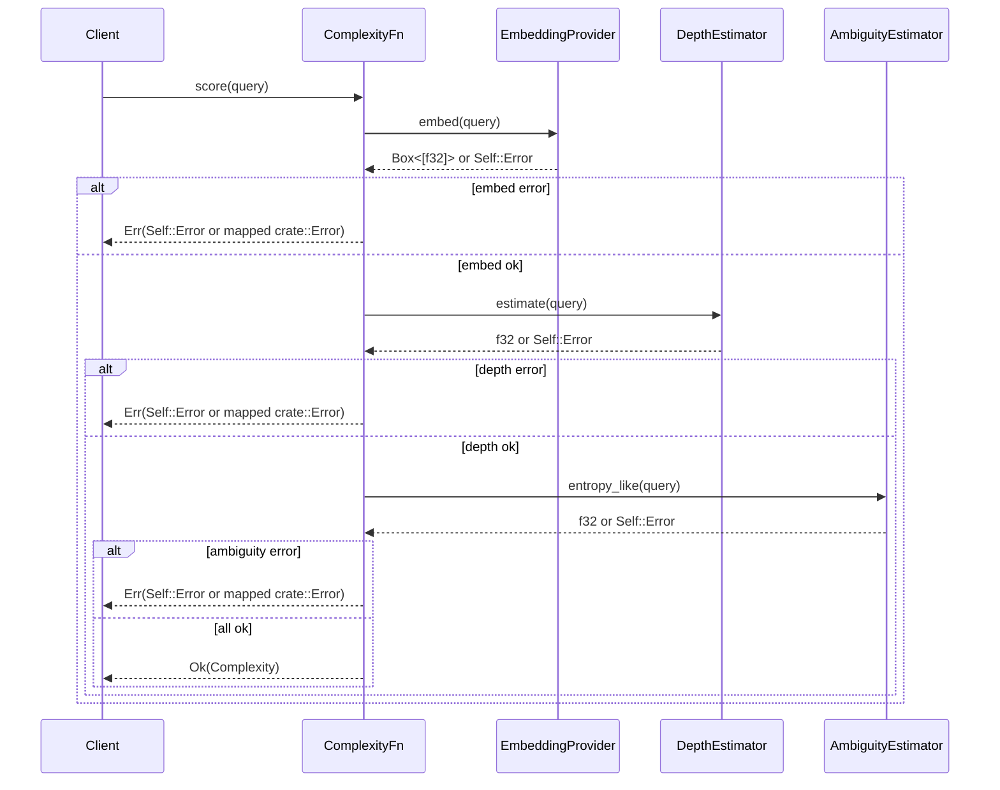

# Design Proposal for the ,`lag_complexity`, Crate: A Production-Ready Implementation of the LAG Cognitive Load Metric

## Introduction: Bridging Principled Reasoning and Production Systems

### Context and Motivation

Modern Large Language Models (LLMs) have demonstrated remarkable capabilities
across a broad spectrum of natural language tasks, from text generation to
complex query understanding.1 However, their proficiency often diminishes when
faced with knowledge-intensive, multi-hop questions that require structured
reasoning. In these scenarios, LLMs are prone to "hallucination"—generating
factually incorrect or logically inconsistent statements.3 While frameworks
like Retrieval-Augmented Generation (RAG) have been developed to mitigate this
by grounding models in external knowledge, they often fall short. Standard RAG
systems rely on direct semantic retrieval, a process that frequently fails to
capture the underlying logical structure of complex queries, leading to the
retrieval of fragmented or irrelevant context and subsequent propagation of
errors through the reasoning chain.4

### The LAG Paradigm

The Logic-Augmented Generation (LAG) paradigm offers a principled alternative
to address these shortcomings.3 Inspired by Cartesian principles of methodical
problem-solving, LAG introduces a "reasoning-first" pipeline that prioritizes
systematic question decomposition and dependency-aware resolution over
immediate, brute-force retrieval.4 This approach represents a significant
architectural shift, moving from purely semantic pattern matching toward a more
structured, robust, and explainable process that mirrors human cognitive
strategies for tackling complex problems. This aligns with broader trends in AI
toward building more sophisticated language agents that incorporate explicit
mechanisms for planning, memory, and reasoning.8

### The Role of CL(q)

The cornerstone of the LAG framework is its adaptive decomposition module,
which intelligently determines _when_ a query is too complex for direct
resolution and must be broken down into simpler, atomic sub-questions. This
decision is governed by the Cognitive Load metric, denoted as CL(q). This
metric serves as a quantitative measure of a query's intrinsic complexity,
integrating signals for its conceptual breadth, required inference steps, and
semantic uncertainty.6 By evaluating

CL(q) against a dynamic threshold, a LAG-based system can decide whether to
proceed with direct generation or to initiate a recursive decomposition
process, ensuring that each reasoning step is taken on a manageable,
well-defined problem.

### Crate Mission Statement

This document outlines the design for the `lag_complexity` crate, a
high-performance, modular, and production-grade Rust implementation of the
CL(q) metric. The mission of this crate is to serve as the "cognitive clutch"
for larger LAG-based agentic systems. It will provide the critical, real-time
signal required to drive intelligent query handling, enabling systems to
dynamically shift between direct, efficient answering for simple queries and
deliberate, structured decomposition for complex ones. Built in Rust, the crate
will leverage the language's strengths in performance, concurrency, and safety
to deliver a reliable and efficient component suitable for demanding production
environments.

### Disambiguation of "Cognitive Complexity"

It is critical to establish a clear distinction at the outset. The cognitive
complexity metric implemented in this crate is the _Cognitive Load_ for natural
language queries as defined in the LAG research paper.6 This is conceptually
and mathematically distinct from the "Cognitive Complexity" metric for source
code understandability developed by SonarSource.11 While both metrics aim to
quantify a form of mental effort or difficulty, the former applies to natural
language and is composed of semantic scope, reasoning depth, and ambiguity,
whereas the latter applies to software code and is based on increments for
breaks in linear control flow and nesting levels.11 This proposal exclusively
concerns the implementation of the LAG paper's

CL(q) metric.

The architectural decision to encapsulate the CL(q) calculation within a
standalone, reusable crate is a strategic one. It moves beyond a monolithic
agent design and embraces modularity, a core principle for building robust and
maintainable AI systems.14 This approach is deeply aligned with conceptual
frameworks like Cognitive Architectures for Language Agents (CoALA), which
advocate for distinct, interoperable components for memory, action, and
decision-making.8 By isolating the complexity scoring logic, several
engineering advantages are unlocked. The component can be independently
benchmarked and optimized for performance, a critical requirement for a
function that may be on the hot path of every incoming query. Its internal
implementations—the providers for each complexity signal—can be swapped out or
upgraded without impacting the core logic of the consuming agent. This
modularity also promotes reusability across different agent implementations or
even other systems that could benefit from a query complexity signal.
Therefore, the creation of the

`lag_complexity` crate is not merely an implementation detail; it is a
foundational choice that enhances the testability, maintainability, and
scalability of the entire AI ecosystem it serves.

## 1. Crate Architecture and Public API

The architecture of the `lag_complexity` crate is designed for modularity,
performance, and ergonomic use. It provides a clear separation of concerns
between the high-level API, the pluggable component providers, and the
configuration, enabling developers to easily integrate and customize the
complexity scoring logic.

### Module Structure and Naming Conventions

The crate will follow standard Rust conventions, with a logical internal module
structure to organize its components. All primary public-facing types will be
re-exported at the crate root for convenient access.

- `lag_complexity::api`: Contains the core public traits (`ComplexityFn`) and
  data structures (`Complexity`, `Trace`).
- `lag_complexity::providers`: Houses the `TextProcessor` trait and type
  aliases for pluggable components (`EmbeddingProvider`, `DepthEstimator`,
  `AmbiguityEstimator`) along with their concrete implementations (e.g.,
  `ApiEmbedding`, `DepthHeuristic`).
- `lag_complexity::config`: Defines the configuration structs (`ScoringConfig`,
  `Sigma`, `Weights`, `Schedule`, `Halting`).
- `lag_complexity::error`: Defines the crate's custom `Error` enum using the
  `thiserror` crate for ergonomic error handling.

### Core Types Deep Dive

The central data structures are designed for transparency and interoperability.

- `Complexity`:

```rust
pub struct Complexity {
    total: f32,
    scope: f32,
    depth: f32,
    ambiguity: f32,
}
```

The fields of the `Complexity` struct are private to preserve the invariant
that `total` always equals the sum of its components. Accessor methods expose
each component so callers can trigger different actions based on which score is
elevated—for example, a high `ambiguity` might prompt clarification, whereas a
high `depth` suggests decomposition. The struct derives `serde::Serialize` for
easy logging and transport of complexity data.

- `Error`: A comprehensive error enum will be defined using `thiserror` to
  provide structured and actionable error information.

```rust
pub enum Error {
    #[error("Configuration error: {0}")]
    Config(String),
    #[error("External API call failed: {0}")]
    Api(#[from] reqwest::Error),
    #[error("Model inference failed: {0}")]
    Inference(String),
    #[error("I/O error: {0}")]
    Io(#[from] std::io::Error),
    // ... other error variants
}
```

### The `ComplexityFn` trait

This trait is the primary public API and the central abstraction for any
complexity scoring engine.

```rust
pub trait ComplexityFn {
    type Error: std::error::Error + Send + Sync + 'static;

    fn score(&self, q: &str) -> Result<Complexity, Self::Error>;
    fn trace(&self, q: &str) -> Result<Trace, Self::Error>;
}
```

- The `score` method represents the hot path, designed for high-throughput,
  low-latency execution in production.
- The `trace` method is designed for diagnostics, debugging, and
  explainability. It will return a `Trace` struct containing a wealth of
  intermediate data: raw scores from each provider before normalisation, the
  specific normalisation parameters that were applied, token counts, a list of
  detected heuristic patterns (e.g., conjunctions or ambiguous pronouns found),
  and the latency of each provider call. This detailed output is invaluable for
  creating golden-file tests (Section 5.3), debugging scoring anomalies, and
  powering stakeholder-facing demonstrations (Section 7).

#### Scoring flow

The sequence diagram below outlines the primary interactions when scoring a
query.



### Provider Traits

These traits are the key to the crate's modularity, allowing for the
implementation of each complexity signal to be swapped at runtime or compile
time.

```rust
pub trait TextProcessor {
    type Output;
    type Error: std::error::Error + Send + Sync;
    fn process(&self, input: &str) -> Result<Self::Output, Self::Error>;
}

pub type EmbeddingProvider<E> =
    dyn TextProcessor<Output = Box<[f32]>, Error = E> + Send + Sync;
pub type DepthEstimator<E> = dyn TextProcessor<Output = f32, Error = E> + Send + Sync;
pub type AmbiguityEstimator<E> = dyn TextProcessor<Output = f32, Error = E> + Send + Sync;
```

All provider methods return a `Result` to ensure that failures, such as a
network timeout or a model loading error, are propagated cleanly through the
system. The trait defines associated `Output` and `Error` types so concrete
providers can expose domain-specific behaviour without forcing a single error
enum on all implementations. Embeddings use `Box<[f32]>` to eliminate spare
capacity, and provider trait objects are `Send + Sync` for cross-thread
invocation. Errors implement `std::error::Error + Send + Sync` to propagate
across threads.

### Configuration (ScoringConfig and sub-types)

The ScoringConfig struct and its components provide a centralised, declarative
way to tune the behaviour of the scoring engine. The entire structure will be
deserialisable from a TOML file using serde, allowing operators to adjust
parameters in different environments (development, staging, production) without
recompiling the application.

- ScoringConfig: The top-level configuration object.
- ScopingConfig: Configures how semantic scope is measured. The initial
  variant, Variance, accepts a window size and all configuration types derive
  Serialise/Deserialise for convenient loading.
- Sigma: An enum representing the normalisation strategy. This provides
  statistical flexibility to adapt to different distributions of raw scores.

```rust
pub enum Sigma {
    MinMax { p01: f32, p99: f32 },
    ZScore { mean: f32, std: f32 },
    Robust { median: f32, mad: f32 },
}
```

- `Weights`: A simple struct for re-weighting the final components of the
  `CL(q)` score. The default will be `1.0` for all components, directly
  matching the unweighted sum in the LAG paper's formula.6

```rust
pub struct Weights {
    pub scope: f32,
    pub depth: f32,
    pub ambiguity: f32,
}
```

- `Schedule`: An enum that implements the decaying threshold logic, `τ(t)`, for
  the split condition. The primary variant directly models the paper's concept
  of a threshold that becomes more lenient as the reasoning process deepens.6

```rust
pub enum Schedule {
    Constant(f32),
    ExpDecay { tau0: f32, lambda: f32 },
}
```

- `Halting`: A struct to hold the parameters for the agent-level "Logical
  Terminator." While the logic is implemented by the consuming agent, these
  parameters are configured alongside the rest of the complexity logic for
  coherence.

```rust
pub struct Halting {
    pub gamma: f32, // Semantic redundancy threshold
    pub t_max: u8,  // Max decomposition steps
}
```

### Feature Flags

Cargo's feature flag system will be used extensively to manage optional
dependencies and conditional compilation, creating a highly flexible and lean
library.

The selection of default features is a deliberate design choice prioritizing
security and ease of use. By disabling `provider-api` by default, the crate
adheres to the principle of least privilege, preventing any unintended network
activity unless explicitly opted into by the developer.17 This is a critical
security posture for a library that might be deployed in sensitive
environments. Conversely, by enabling local, pure-Rust providers (

`provider-candle`, `onnx`) and parallelism (`rayon`) by default, the crate
provides a "batteries-included" experience. A developer can add
`lag_complexity` to their project and immediately have a functional,
performant, and self-contained scoring engine without needing to configure
external dependencies like a C++ toolchain (required by `tch`/LibTorch) or set
up API keys. This combination creates a secure-by-default yet
powerful-out-of-the-box library that serves the needs of most users while
guiding them toward safe and efficient deployment patterns.

#### Table 1: Feature Flag Specification

| Feature Flag      | Dependencies                                      | Purpose                                                                               | Default |
| ----------------- | ------------------------------------------------- | ------------------------------------------------------------------------------------- | ------- |
| `provider-api`    | `reqwest`, `tokio`                                | Enables providers that call external HTTP APIs for embeddings or LLM-based estimates. | Off     |
| `provider-tch`    | `tch`                                             | Enables local transformer models via the `tch` crate (LibTorch backend).              | Off     |
| `provider-candle` | `candle-core`, `candle-nn`, `candle-transformers` | Enables local transformer models via the pure-Rust `candle` framework.                | On      |
| `onnx`            | `ort`                                             | Enables ONNX Runtime for lightweight classifier models.                               | On      |
| `rayon`           | `rayon`                                           | Enables parallel execution for batch scoring and concurrent provider calls.           | On      |
| `python`          | `pyo3`                                            | Builds Python bindings for the crate.                                                 | Off     |
| `wasm`            | `wasm-bindgen`, `js-sys`                          | Builds a WebAssembly module for browser/JS environments.                              | Off     |
| `cli`             | `clap`                                            | Builds the `lagc` command-line interface binary.                                      | On      |

## 2. Component Signal Implementations

The crate will provide multiple, interchangeable implementations for each of
the three core signals—Semantic Scope, Reasoning Steps, and Ambiguity. This
tiered approach allows users to select the optimal trade-off between accuracy,
latency, and computational cost for their specific application.

### 2.1 Semantic Scope: ,`σ(Var(ϕ(q)))`

The Semantic Scope component measures the conceptual breadth of a query. A high
scope suggests the query touches on multiple, disparate topics, which may
require a wider retrieval strategy.

#### Default Implementation (,`ScopeVariance`,)

- **Formulaic Fidelity:** The default implementation will adhere precisely to
  the definition provided in the LAG paper: the variance across the dimensions
  of the query's embedding vector, `ϕ(q)`.6 The mathematical formula is

Var(v)=d1​∑i=1d​(vi​−vˉ)2, where v is the d-dimensional embedding vector. This
direct translation ensures that the implementation is grounded in the source
research.

- **Generic Provider:** The `ScopeVariance` struct will be generic over any
  type that satisfies the `EmbeddingProvider` alias of `TextProcessor`,
  decoupling the variance calculation from the source of the embedding itself.
- **Numerical Stability:** To prevent floating-point precision errors,
  especially with high-dimensional embeddings (e.g., 768 or 1024 dimensions),
  the variance calculation will use a numerically stable one-pass algorithm,
  such as Welford's online algorithm. This avoids the catastrophic cancellation
  that can occur with the naive two-pass formula.

#### Embedding Providers

The quality of the Semantic Scope signal is entirely dependent on the quality
of the underlying embedding, `ϕ(q)`. The crate will provide both remote and
local options.

- `ApiEmbedding`: This provider, enabled by the `provider-api` feature, is
  designed for systems that leverage external, state-of-the-art embedding
  models via an API.

- It will use the `reqwest` library for robust, asynchronous HTTP requests to
  services like OpenAI, Cohere, or a self-hosted inference endpoint.
- To handle the realities of network communication, it will feature
  configurable timeouts and an exponential backoff retry strategy for transient
  failures (e.g., HTTP 503 errors).
- Security is paramount. API keys will be handled according to best practices,
  read from environment variables or a secure configuration store, and never
  accepted as plaintext function arguments or hardcoded in the source.19
- `LocalModelEmbedding`: This provider serves as a facade for running embedding
  models locally, which is crucial for air-gapped environments, low-latency
  requirements, or cost control.

- It will conditionally compile to use either the `tch` crate (backed by
  LibTorch) or the `candle` crate (a pure-Rust ML framework), depending on
  which feature flag is enabled.
- The documentation will recommend a default model that offers a strong balance
  of performance and quality, such as a small, efficient sentence-transformer
  like `all-MiniLM-L6-v2`. Clear instructions will be provided for downloading
  model weights and configuring the provider to use them.

### 2.2 Reasoning Steps: ,`σ(Depth(q))`

This component estimates the number of latent inference steps required to
answer a query. A high depth score is the primary trigger for query
decomposition in a LAG system.

#### Heuristic Baseline (,`DepthHeuristic`,)

This implementation provides a very fast, dependency-free baseline for
estimating reasoning depth. While not as accurate as a model-based approach, it
serves as an excellent low-latency first-pass filter. It operates by
identifying and counting linguistic markers that often correlate with syntactic
and logical complexity.22

- **Feature Engineering:**

- **Clause Connectors:** It will identify and score coordinating conjunctions
  (`and`, `or`, `but`) and subordinating conjunctions (`if`, `because`,
  `while`, `since`, `although`). Subordinating conjunctions will be assigned a
  higher weight, as they typically introduce dependent logical conditions.
- **Comparative Structures:** It will detect phrases indicative of comparison,
  such as "compared to," "versus," "as opposed to," and the use of comparative
  adjectives ("more than," "less than").
- **Dependency Chains:** It will penalize sequences of prepositional phrases,
  particularly possessive chains (e.g., "the name of the director of the sequel
  to the movie..."), which often signal nested entity relationships.
- **Relative Clauses:** It will increment the score for clauses introduced by
  relative pronouns like "who," "which," "that," and "whose."
- **Enumerations:** It will recognize explicit lists and enumerations (e.g.,
  "What are the differences between A, B, and C?").
- **Aggregation:** The final heuristic score will be a weighted sum of the
  counts of these features. The weights will be empirically tuned against a
  curated set of multi-hop questions.

#### Model-Backed Options

For higher accuracy, the crate will provide model-based estimators.

- `DepthClassifierOnnx`: Enabled by the `onnx` feature, this provider uses a
  small, pre-trained model in the ONNX format for fast local inference.

- **Architecture:** The model will be a simple feed-forward neural network or a
  gradient-boosted tree model, designed for minimal computational overhead.
- **Input:** To ensure low latency, the model will not process raw text.
  Instead, its input will be a compact feature vector derived from the same
  linguistic signals used by `DepthHeuristic` (e.g., counts of conjunctions,
  POS tags, dependency patterns). This transforms the task from a complex
  sequence problem into a simple and fast classification/regression problem on
  a fixed-size vector.
- **Output:** The model will output a calibrated continuous value representing
  the predicted number of reasoning steps.
- `DepthFromLLM`: Enabled by the `provider-api` feature, this is the
  highest-fidelity but also highest-latency option.

- It wraps an API call to an external LLM (e.g., GPT-4o-mini).
- The prompt will be carefully engineered using a few-shot approach, asking the
  LLM to explicitly break down the question and count the sub-questions. For
  example:
  `Prompt: Analyse the question "Which university did the CEO of the company that`
   `developed the original iPhone attend?" and`
  `state the number of reasoning steps required. Response: 2`.

### 2.3 Ambiguity: ,`σ(H(q))`

This component quantifies the semantic uncertainty in a query. A high ambiguity
score suggests the query may have multiple valid interpretations and should be
clarified before attempting to answer.

#### Heuristic Baseline (,`AmbiguityHeuristic`,)

This provides a fast, lightweight signal for common sources of ambiguity in
English text.25

- **Feature Engineering:**

- **Coreference Risk (Anaphora):** The heuristic will count third-person
  pronouns (`it`, `he`, `she`, `they`) and demonstratives (`this`, `that`). The
  score is weighted higher if a plausible antecedent (a proper noun or definite
  noun phrase from the same number/gender class) is not found within a small,
  preceding context window (e.g., the current and previous sentence). This is a
  simplified approach to anaphora resolution, focusing on identifying risk
  rather than fully resolving it.28
- **Polysemy and Homonymy Risk:** It will use a curated dictionary of common
  ambiguous entities (e.g., "Mercury": planet, god, element, car brand; "Nile":
  river, band). An NER pre-pass (even a simple regex-based one) will identify
  these terms and increment the score.
- **Ellipsis and Vagueness:** The score will be penalized for vague quantifiers
  ("some," "a few," "several") and deictic terms ("here," "there," "then") that
  lack a concrete anchor in the query's context.
- **Aggregation:** The scores from these risk factors will be combined into a
  single pseudo-entropy value. Laplace smoothing will be applied to ensure a
  stable, non-zero score even for queries with no detected ambiguity signals.

#### Model-Backed Option (,`AmbiguityClassifierOnnx`,)

- Enabled by the `onnx` feature, this provider uses a lightweight text
  classification model for more nuanced ambiguity detection.
- **Architecture:** The model could be a fine-tuned DistilBERT 34 or a similar
  compact transformer, exported to ONNX for efficient inference.36
- **Training Data:** The model would be trained on a dataset specifically
  designed for ambiguity, such as AmbigQA, which contains questions annotated
  with multiple plausible interpretations.38
- **Output:** The model would perform multi-class classification, predicting a
  label such as `Clear`, `Possibly Ambiguous`, or `Highly Ambiguous`. These
  categorical labels would then be mapped to a numeric score (e.g., 0.1, 0.5,
  0.9) to be used in the final CL(q) calculation.

The design's explicit separation of heuristic, lightweight model, and full LLM
providers for the same signal is a powerful architectural pattern. It
acknowledges that no single implementation is optimal for all use cases. A
system deployed on an edge device with limited resources might be constrained
to the heuristic provider, while a high-powered cloud service could afford the
accuracy of the ONNX model. This tiered system enables not only static,
environment-specific configuration but also dynamic, intelligent routing. A
sophisticated consumer could implement a chain-of-responsibility pattern:
first, run the fast heuristic. If the score falls into a "grey area" of
uncertainty, escalate the query to the more accurate but more expensive ONNX
provider for a definitive judgment. This approach also builds in resilience; if
an external LLM API is unavailable, the system can gracefully degrade to a
local provider, ensuring service continuity. This flexibility in managing the
trade-offs between accuracy, latency, and cost is a hallmark of a
production-oriented, industrial-grade system.

#### Table 2: Provider Implementation Trade-offs (Depth & Ambiguity)

| Provider Type       | Accuracy | Latency         | Cost (Compute/API) | Dependencies                | Use Case                                                             |
| ------------------- | -------- | --------------- | ------------------ | --------------------------- | -------------------------------------------------------------------- |
| **Heuristic**       | Low      | Very Low (<1ms) | Negligible         | None                        | Default, low-latency applications, initial signal.                   |
| **ONNX Classifier** | Medium   | Low (~5-20ms)   | Low (local CPU)    | `ort` crate, model file     | Production systems needing a balance of speed and accuracy.          |
| **External LLM**    | High     | High (500ms+)   | High               | `reqwest`, `tokio`, API key | Systems where accuracy is paramount and latency/cost are acceptable. |

## 3. Configuration Deep Dive: Normalisation, Scheduling, and Halting

Effective configuration is central to the `lag_complexity` crate's
adaptability. The `ScoringConfig` structure provides fine-grained control over
how raw signals are processed and interpreted, allowing the system to be tuned
for specific domains and performance requirements.

### Normalisation (Sigma)

The raw scores produced by the various providers—embedding variance, heuristic
counts, or model outputs—exist on different, arbitrary scales. The purpose of
the Sigma normalisation module is to transform these raw scores into a
consistent, comparable range, typically [0, 1], so they can be meaningfully
aggregated into the final CL(q) score.

- **Implementations:**

- `Sigma::MinMax { p01, p99 }`: This strategy performs a linear scaling of the
  raw score. To enhance robustness against extreme outliers, it scales based on
  the 1st and 99th percentiles of the expected score distribution, rather than
  the absolute minimum and maximum. Any value below `p01` is clamped to 0, and
  any value above `p99` is clamped to 1.
- `Sigma::ZScore { mean, std }`: This method standardizes scores by subtracting
  the mean and dividing by the standard deviation of the expected distribution.
  The resulting Z-score is then typically passed through a sigmoid function to
  map it to the [0, 1] range. This approach is effective when the raw scores
  are approximately normally distributed.
- `Sigma::Robust { median, mad }`: For distributions with significant outliers
  or skew, this provides a more robust alternative to Z-scoring. It uses the
  median as the measure of central tendency and the Median Absolute Deviation
  (MAD) as the measure of dispersion, both of which are less sensitive to
  extreme values.
- **Calibration is Critical:** The parameters for each `Sigma` variant (`p01`,
  `p99`, `mean`, `std`, `median`, `mad`) are not universal constants. Their
  effectiveness depends entirely on being calibrated against a dataset of
  queries that is representative of the target domain. The crate will ship with
  a set of default parameters calibrated on a general-purpose web question
  dataset. However, the documentation will strongly emphasize that for optimal
  performance, users must perform their own calibration step using
  domain-specific data and the evaluation harness provided by the crate (see
  Section 5).

### Split Scheduling (,`Schedule`, and ,`τ(t)`,)

This component directly implements the adaptive decomposition logic from the
LAG paper: `SplitCondition(q) = CL(q) > τ(t)`.6 The core concept is that the
threshold for decomposition,

`τ(t)`, should not be static. It should decay as the reasoning process unfolds
(where `t` represents the current decomposition step or recursion depth).

- **Rationale:** This dynamic threshold encourages the system to be aggressive
  in decomposing the initial, highly complex query (`t=0`, `τ(t)` is high). As
  the system works through the resulting sub-problems, the threshold becomes
  more lenient (`t` increases, `τ(t)` decreases), preventing the system from
  getting stuck in excessive, fine-grained decomposition of sub-problems that
  are already reasonably simple.
- **Implementation:** The `ScoringConfig` will expose a method,
  `is_split_recommended(&self, complexity: f32, step: u32) -> bool`, which
  encapsulates this logic.
- `Schedule::ExpDecay { tau0, lambda }`: This variant implements an exponential
  decay function for the threshold: `τ(t) = tau0 * exp(-lambda * t)`.

- `tau0`: The initial threshold at `t=0`.
- `lambda`: The decay rate, controlling how quickly the threshold decreases
  with each step.

### Halting Conditions (,`Halting`,)

The `Halting` configuration provides the parameters for the "Logical
Terminator," a critical safety and efficiency mechanism described in the LAG
paper.4 These guardrails prevent the consuming agent from entering infinite
reasoning loops or wasting computational resources on unproductive paths.

- **Role of the Crate:** It is essential to clarify that the `lag_complexity`
  crate itself does _not_ implement the halting logic. Its role is to serve as
  a unified configuration point for these parameters, which are then consumed
  and acted upon by the higher-level agent that manages the state of the
  reasoning loop.
- **Parameters:**

- `gamma: f32`: The semantic saturation threshold, typically a value like 0.9.
  The agent should use this to halt reasoning if newly retrieved information is
  more than 90% similar to the context it has already gathered, indicating
  diminishing returns.
- `t_max: u8`: The absolute maximum number of decomposition steps, for example,
  5. This acts as a hard stop to prevent runaway recursion, ensuring
  tractability.

By centralizing these parameters within `ScoringConfig`, the crate provides a
single, coherent interface for tuning the entire cognitive control loop of a
LAG agent, from the initial decomposition decision to the final termination
conditions.

## 4. Production Engineering and Operations

A library intended for production use in high-performance AI systems must be
engineered for concurrency, efficiency, observability, and security. This
section details the non-functional requirements and design choices that will
ensure the `lag_complexity` crate is robust and operationally sound.

### Concurrency and Parallelism

Rust's fearless concurrency model is a primary reason for its selection for
this task. The crate will leverage this capability to maximize throughput.

- **Batch Processing:** The `ComplexityFn` trait will expose a
  `score_batch(&self, q: &[&str]) -> Vec<Result<Complexity, Error>>` method.
  Processing queries in batches is significantly more efficient, especially
  when using local models on GPUs or calling external APIs.
- `rayon`**Integration:** When the `rayon` feature flag is enabled,
  parallelism will be applied at two levels:

1. **Inter-Query Parallelism:** The `score_batch` method will use
   `rayon::par_iter()` to process multiple queries in the batch concurrently
   across available CPU cores.
2. **Intra-Query Parallelism:** Within a single `score` call, the three
   independent provider functions (`embed`, `estimate`, `entropy_like`) will be
   executed in parallel using `rayon::join`. This allows the system to overlap
   I/O-bound operations (like an API call for embeddings) with CPU-bound
   operations (like running heuristic estimators), significantly reducing the
   end-to-end latency for a single query.

### Caching Strategy

The most computationally expensive operation in the scoring pipeline is
typically embedding generation. An effective caching strategy is therefore
essential for performance and cost reduction.

- **Targeted Caching:** The primary target for caching is the output of the
  `EmbeddingProvider`. Caching the final `Complexity` score is less effective,
  as small variations in the query text would lead to cache misses.
- **Library Selection:** The `moka` crate will be used for caching.40 While

`dashmap` is an excellent general-purpose concurrent hash map 42,

`moka` is a specialized, high-performance caching library inspired by Java's
Caffeine. It provides essential caching features out-of-the-box, such as
size-based eviction (LRU/LFU policies) and time-based expiration (TTL/TTI),
which are critical for managing the cache's memory footprint and data freshness.

- **Implementation:** A `CachingEmbeddingProvider` decorator will be
  implemented. This struct will wrap an existing `EmbeddingProvider` and
  internally use a `moka::sync::Cache` to store results. The cache key will be
  a cryptographic hash (e.g., SHA-256) of the input text to ensure a uniform
  key distribution and fixed key size. The cache itself will be configurable
  for maximum number of entries and an optional time-to-live (TTL) for entries.

### Observability (Metrics & Tracing)

To operate and debug the system in production, deep visibility into its
behaviour is required. The crate will provide first-class support for modern
observability practices.

- **Frameworks:** It will use the `tracing` crate for structured, context-aware
  logging and performance profiling via spans, and the `metrics` crate as a
  facade for emitting telemetry data.45
- **Structured Tracing:** All primary public functions (`score`, `score_batch`)
  and each provider's main method (`embed`, `estimate`, etc.) will be
  instrumented with the `#[tracing::instrument]` macro. This will automatically
  create spans that capture the function's execution time, arguments, and
  return values, providing a detailed, hierarchical view of a request's
  lifecycle.
- **Key Metrics:** The following metrics will be emitted via the `metrics`
  facade:

- `lag_complexity_requests_total`: A `Counter` incremented for each call to
  `score` or `score_batch`.
- `lag_complexity_request_latency_seconds`: A `Histogram` that records the
  end-to-end latency of a `score` operation.
- `lag_complexity_provider_latency_seconds`: A `Histogram` with a `provider`
  label (e.g., `provider="embedding"`) to isolate the performance of each
  internal component.
- `lag_complexity_provider_errors_total`: A `Counter` with `provider` and
  `error_type` labels to track failures within each component.
- **Prometheus Integration:** The documentation and CLI tool will provide a
  reference implementation for how to use the `metrics-exporter-prometheus`
  crate to expose these metrics on a `/metrics` HTTP endpoint, making them
  readily consumable by Prometheus and other compatible monitoring systems.46

### Security

The crate will be designed with security as a primary consideration.

- **Secure by Default:** As detailed in Section 1, the crate will not perform
  any network operations unless the `provider-api` feature is explicitly
  enabled. This prevents accidental data leakage.
- **API Key Management:** Implementations that use external APIs will be
  designed to read credentials from environment variables or a secure
  configuration system. They will never accept API keys as direct function
  arguments, and documentation will explicitly warn against hardcoding secrets,
  in line with industry best practices.19
- **PII Scrubbing Hook:** Recognizing that queries may contain Personally
  Identifiable Information (PII), the `ComplexityFn` will expose a builder
  method `with_redaction_hook`. This allows the consumer to inject a custom
  function that will be applied to all input strings before any processing
  occurs. This hook enables integration with PII scrubbing libraries (e.g.,
  those inspired by Microsoft's Presidio 49 or other custom solutions 50) and
  is a critical feature for maintaining data privacy and achieving compliance
  in regulated domains.

### Determinism

For reproducible testing and evaluation, the crate's output must be
deterministic for a given input and configuration.

- **Model Versioning:** All local models (embedding, ONNX classifiers) will
  have their versions explicitly pinned.
- **Seeding:** Any internal processes that rely on random number generation
  (e.g., certain model layers, stochastic preprocessing) will be explicitly
  seeded.
- **Configuration Snapshotting:** The calibrated normalisation parameters
  (`Sigma`) and heuristic weights will be stored in a version-controlled
  configuration file, ensuring that the exact parameters used for evaluation
  are captured and reproducible.

## 5. Comprehensive Testing and Evaluation Strategy

A rigorous, multi-layered testing and evaluation strategy is essential to
validate the correctness, robustness, and effectiveness of the `lag_complexity`
crate. The strategy encompasses unit tests for isolated logic, property tests
for behavioural invariants, integration tests for component composition, and a
large-scale evaluation against academic datasets to measure real-world
performance.

### Unit Tests

Located directly alongside the code they test (within `#[cfg(test)]` modules),
unit tests will verify the correctness of individual functions and components
in isolation.

- **Mathematical and Configuration Logic:**

- The variance calculation will be tested against known inputs and edge cases
  (e.g., zero-length vectors, vectors with all identical elements).
- Each `Sigma` normalisation implementation will be tested to ensure it
  correctly scales inputs according to its formula and handles values outside
  the calibrated range gracefully (clipping).
- The `Schedule::ExpDecay` logic will be tested to confirm that the threshold
  `τ(t)` is always positive and monotonically decreasing as the step `t`
  increases.
- **Heuristic Components:**

- Tests for `DepthHeuristic` will assert that adding linguistic complexity
  markers (e.g., a subordinating conjunction or a relative clause) never
  decreases the resulting depth score.
- Tests for `AmbiguityHeuristic` will assert that injecting unresolved anaphora
  (e.g., "it" without a clear antecedent) or known homonyms never decreases the
  ambiguity score.

### Property Tests (,`proptest`,)

Property-based testing, using the `proptest` crate, will be employed to test
for invariants that must hold true for a wide range of arbitrary, automatically
generated inputs. This is highly effective at finding edge cases that human
test writers might miss.

- **Core Invariants:**

- The `score(q)` function must never panic for any valid UTF-8 string `q`.
- All components of the returned `Complexity` struct (`total`, `scope`,
  `depth`, `ambiguity`) must be non-negative.
- **Behavioral Properties:**

- **Idempotence:** `score(q)` should be equal to `score(q.clone())`.
- **Scope Order-Insensitivity:** For the `ScopeVariance` component,
  permutations of word order in the input query should result in only a minor
  change (within a small epsilon) to the scope score, as variance is largely
  insensitive to dimension order.
- **Monotonicity of Edits:** Adding specific complexity-increasing phrases
  (e.g., "versus", "in addition to") should generally lead to a non-decreasing
  `depth` score.

### Integration Tests

Located in the `tests/` directory, these tests will verify that the different
components of the crate work correctly together.

- **Golden File Testing:** This will be the cornerstone of regression testing.
  A set of approximately 50 curated queries representing a wide range of
  complexity types (single-hop, multi-hop, ambiguous, high-scope, simple, and
  nonsensical) will be stored in a "golden file." The integration test will
  execute the `trace()` method for each query and serialise the detailed
  `Trace` object to a snapshot file. This snapshot will be committed to version
  control. On subsequent test runs, the new output will be compared against the
  golden snapshot; any discrepancies will fail the test, immediately flagging
  unintended changes in behaviour from modifications to heuristics, models, or
  normalisation logic.
- **Provider and Feature Flag Integration:** Specific integration tests will be
  compiled only when certain feature flags are enabled (e.g.,
  `#[cfg(feature = "provider-api")]`). These tests will ensure that API-based
  providers correctly serialise requests and deserialise responses (using mock
  servers like `wiremock`) and that ONNX models can be loaded and executed
  successfully.

### Dataset-Driven Evaluation

To validate that the complexity scores are not just internally consistent but
also correlate with real-world notions of complexity, a dedicated evaluation
harness will be built. This harness will run the scorer over established
academic datasets and report on its performance.

- **Evaluation Harness:** A standalone binary (`cargo run --bin evaluate`) will
  be created to automate this process. It will load specified datasets, run the
  `lag_complexity` scorer on the questions, and compute a suite of validation
  metrics.
- **Dataset-to-Component Mapping:**

- **Reasoning Steps (**`depth`**):** Performance will be measured against
  multi-hop question-answering datasets like **HotpotQA** 52,

**2WikiMultiHopQA**, and **MuSiQue**. The number of supporting facts or
annotated reasoning hops will serve as the ground truth for reasoning depth.

- **Ambiguity (**`ambiguity`**):** The ambiguity score will be validated
  against datasets designed to study ambiguity, such as **AmbigQA** 38 and

**ASQA**. The ground truth will be the dataset's annotation indicating whether
a question has multiple plausible interpretations.

- **Semantic Scope (**`scope`**):** As there is no direct ground-truth label
  for "scope," its behaviour will be evaluated indirectly. Using diverse
  datasets from the **BEIR benchmark** 54 and Semantic Textual Similarity (STS)
  tasks, the hypothesis is that a set of queries with high conceptual diversity
  (low average inter-query similarity) should produce a higher average scope
  score than a set of topically narrow, highly similar queries.
- **Evaluation Metrics:**

- **Rank Correlation:** The primary metrics will be **Kendall's Tau (τ)** and
  **Spearman's Rho (ρ)** rank correlation coefficients.56 These are chosen over
  simpler metrics like Pearson correlation because the absolute value of the
  complexity score is less important than its ability to correctly

_rank_ questions by difficulty. A strong positive rank correlation indicates
that the scorer is effective at distinguishing more complex queries from
simpler ones.

- **Classifier Calibration:** For any model-based classifiers (e.g.,
  `AmbiguityClassifierOnnx`), the **Expected Calibration Error (ECE)** will be
  reported.57 A low ECE indicates that the model's confidence in its
  predictions is well-calibrated (e.g., when it predicts a class with 80%
  confidence, it is correct about 80% of the time).
- **Reporting:** The evaluation harness will generate a version-controlled
  `EVALUATION.md` file, summarizing the key correlation and calibration metrics
  for each version of the crate. This provides a transparent and reproducible
  record of the scorer's empirical validity.

## 6. Performance Benchmarking Protocol

To ensure the `lag_complexity` crate meets the performance requirements of
production AI systems, a systematic benchmarking protocol will be established.
This protocol will measure both the performance of individual components
(micro-benchmarks) and the end-to-end latency and throughput of the system
(macro-benchmarks), with a focus on reproducibility.

### Framework

All benchmarks will be implemented using the `criterion` crate, the de facto
standard for rigorous statistical benchmarking in the Rust ecosystem.
Benchmarks will reside in the `benches/` directory and can be executed via
`cargo bench`.

### Micro-benchmarks

These benchmarks will isolate and measure the performance of individual,
critical components to identify potential bottlenecks and guide optimization
efforts.

- **Provider Latency:**

- `EmbeddingProvider::process`: The latency of this method will be measured for
  each available provider (`ApiEmbedding`, `LocalModelEmbedding` with `tch` and
  `candle` backends). This will quantify the performance trade-offs between
  remote API calls and local model inference.
- `DepthHeuristic::estimate` and `AmbiguityHeuristic::estimate`: The execution
  time of the heuristic-based estimators will be measured to confirm they meet
  the sub-millisecond performance target.
- `ONNX` Model Inference: The latency of a single inference pass for the
  `DepthClassifierOnnx` and `AmbiguityClassifierOnnx` models will be
  benchmarked.
- **Computational Overhead:**

- The time taken for the variance calculation and the application of `Sigma`
  normalisation will be measured to ensure they contribute negligibly to the
  overall latency.

### Macro-benchmarks

These benchmarks will assess the end-to-end performance of the public API,
simulating real-world usage patterns.

- **End-to-End Latency and Throughput:**

- The `ComplexityFn::score` method will be benchmarked to measure the latency
  for a single query.
- The `ComplexityFn::score_batch` method will be benchmarked to measure
  throughput (queries per second).
- **Workload Variation:** Both single-query and batch benchmarks will be run
  against three distinct datasets of queries to understand performance under
  different conditions:

- **Short Queries:** Average length of ~10 words.
- **Medium Queries:** Average length of ~25 words.
- **Long Queries:** Average length of ~75 words.
- **Provider Combinations:** Benchmarks will be run for different compositions
  of providers (e.g., full heuristic, heuristic + ONNX, full API) to provide
  users with clear performance expectations for each configuration.

### Scalability Benchmarks

A key advantage of the Rust implementation is its ability to leverage
multi-core processors. These benchmarks will quantify the performance gains
from parallelism.

- **Rayon speed-up:** Benchmark `score_batch` with the `rayon` feature enabled,
  running on 1, 2, 4, 8, and 16 threads. The results will be used to calculate
  the speed-up factor and assess how effectively the implementation scales with
  additional CPU cores.

### Reporting

Transparent and reproducible performance reporting is crucial for users and
maintainers.

- **Criterion reports:** The `criterion` framework automatically generates
  detailed HTML reports with statistical analysis of benchmark runs, which can
  be archived for historical comparison.
- **Version-Controlled Summary:** A `BENCHMARKS.md` file will be maintained in
  the root of the repository. For each release, this file will be updated with
  a summary table of the most important performance metrics (e.g., p95 latency
  for a medium-length query, max throughput for a batch of medium-length
  queries). The report will also document the hardware (CPU model, core count)
  and software (Rust version, OS, crate feature flags) configuration used for
  the benchmark run, ensuring that the results are reproducible.

## 7. Stakeholder Demonstration and Application

To effectively communicate the value and functionality of the `lag_complexity`
crate to a broader audience, including product managers, technical leadership,
and other stakeholders, a set of clear and compelling demonstrations will be
developed. These demonstrations will translate the abstract concept of
"cognitive load" into tangible, intuitive examples of improved system behaviour.

### Live "Complexity Meter" (WASM Demo)

This interactive web-based demonstration will provide an immediate, hands-on
experience of the complexity metric in action.

- **Implementation:** A lightweight, single-page web application will be
  created. The core logic will be powered by the `lag_complexity` crate
  compiled to WebAssembly (WASM) using the `wasm-bindgen` toolchain, enabled by
  the `wasm` feature flag.58 This allows the entire Rust-based scoring engine
  to run directly and efficiently in the user's browser, with no server-side
  backend required.
- **User Interface and Functionality:** The UI will feature a large text input
  area where a user can type or paste a question. As the user types, the input
  will be passed to the WASM module in real-time. The application will display:

- A set of gauges or progress bars visualizing the normalised scores for
  `total`, `scope`, `depth`, and `ambiguity`. These will update dynamically,
  providing instant feedback.
- A color-coded overall complexity indicator (e.g., Green for Low, Yellow for
  Medium, Red for High) with a corresponding message, such as "Simple query,
  ready to answer" or "Complex query, recommend decomposition."
- A detailed output pane showing the raw data from the `trace()` method,
  allowing more technical users to inspect the underlying heuristic triggers
  and provider scores.
- **Impact:** This demonstration is highly effective for product reviews and
  technical showcases. It makes the abstract metric tangible and allows
  stakeholders to develop an intuitive "feel" for what kinds of questions are
  considered complex by the system.

### Python Notebook Walkthroughs

For a more narrative and comparative demonstration, a series of Jupyter
notebooks will be created. These will leverage the Python bindings generated by
the `pyo3` crate, enabled by the `python` feature flag.61

- **Scenario 1: Smart Assistant vs. Clumsy Intern**

- **Objective:** To demonstrate how the `depth` score drives intelligent task
  decomposition.
- **Narrative:** The notebook will present a complex, multi-hop question such
  as: "What is the name of the university where the author of the book that the
  film 'Arrival' is based on taught?"

- The "Clumsy Intern" represents a baseline system that attempts to answer this
  directly with a single RAG query. The notebook will show this failing,
  retrieving irrelevant documents or hallucinating an incorrect answer.
- The "Smart Assistant" represents a LAG-enabled system. Its first step is to
  call `lag_complexity.score()`. The notebook will show the output,
  highlighting a high `depth` score. Based on this signal, the assistant
  decomposes the query into a logical chain:

1. "What book is the film 'Arrival' based on?"
2. "Who is the author of that book?"
3. "At which university did that author teach?"

- The notebook will then show the system answering each sub-question
  sequentially, leading to a correct and fully supported final answer.
- **Scenario 2: The Ambiguity Resolver**

- **Objective:** To demonstrate how the `ambiguity` score prevents incorrect
  assumptions and improves user interaction.
- **Narrative:** The notebook will use a semantically ambiguous query, such as
  "What is the primary source of the Nile?" (which has two major tributaries,
  the White Nile and the Blue Nile) or "Who is the most famous Mercury?"

- A baseline system is shown guessing one of the possible interpretations,
  potentially providing an answer that is correct but not what the user
  intended.
- The LAG-enabled system first calls `lag_complexity.score()` and notes a high
  `ambiguity` score.
- Instead of answering, the system uses this signal to pivot to a clarification
  dialogue: "This question is ambiguous. Are you asking about the White Nile or
  the Blue Nile?" or "Are you referring to Freddie Mercury (the singer), the
  planet Mercury, or the Roman god Mercury?"
- **Impact:** This demonstrates how the crate enables a system to be safer and
  more user-centric by recognizing ambiguity and proactively seeking
  clarification rather than making risky assumptions.

These demonstrations, powered by the crate's `wasm` and `python` bindings, will
provide powerful tools for communicating its value beyond the immediate
implementation team.

## 8. Reference Implementation and Usage Patterns

To ensure developers can quickly and correctly integrate the `lag_complexity`
crate, the documentation will include clear, practical examples of its primary
usage patterns. These examples will serve as both a guide and a reference
implementation for common configurations.

### The `DefaultComplexity` engine

A central example demonstrates the composition of the default, general-purpose
`ComplexityFn` implementation. This struct holds references to the configured
providers and the scoring configuration, acting as the primary engine for
calculating complexity.

```rust
use lag_complexity::api::{Complexity, ComplexityFn};
use lag_complexity::config::ScoringConfig;
use lag_complexity::providers::{AmbiguityEstimator, DepthEstimator, EmbeddingProvider};

pub struct DefaultComplexity<'a, EE, DE, AE> {
    emb: &'a dyn EmbeddingProvider<EE>,
    depth: &'a dyn DepthEstimator<DE>,
    amb: &'a dyn AmbiguityEstimator<AE>,
    cfg: &'a ScoringConfig,
}

// Constructor and other methods omitted for brevity...

impl<'a, EE, DE, AE> ComplexityFn for DefaultComplexity<'a, EE, DE, AE>
where
    EE: std::error::Error + Send + Sync,
    DE: std::error::Error + Send + Sync,
    AE: std::error::Error + Send + Sync,
{
    type Error = Box<dyn std::error::Error + Send + Sync>;

    fn score(&self, q: &str) -> Result<Complexity, Self::Error> {
        // Parallel execution path using `rayon`
        #[cfg(feature = "rayon")]
        let (e_res, d_res, a_res) = rayon::join(
            || self.emb.process(q),
            || self.depth.process(q),
            || self.amb.process(q),
        );

        // Sequential execution path if `rayon` is disabled
        #[cfg(not(feature = "rayon"))]
        let (e_res, d_res, a_res) = (
            self.emb.process(q),
            self.depth.process(q),
            self.amb.process(q),
        );

        let embedding = e_res?;
        let raw_depth = d_res?;
        let raw_ambiguity = a_res?;

        // Calculate variance and apply normalisation
        let variance = calculate_variance(&embedding);
        let scope = self.cfg.sigma.apply(variance);
        let depth = self.cfg.sigma.apply(raw_depth);
        let ambiguity = self.cfg.sigma.apply(raw_ambiguity);

        // Apply weights and construct the final result
        let total = self.cfg.weights.sum(scope, depth, ambiguity);

        Ok(Complexity {
            total,
            scope,
            depth,
            ambiguity,
        })
    }
    // ... trace() implementation ...
}
```

This example clearly illustrates the composition pattern, the use of
`rayon::join` for concurrent provider execution, and the conditional
compilation based on the `rayon` feature flag. It walks through the logical
flow from raw provider outputs to the final, normalised, and weighted
`Complexity` score.

### Configuration from File

To promote best practices for configuration management, an example will show
how to deserialise the `ScoringConfig` from a TOML file. This allows for easy
tuning of the system's behaviour without requiring code changes or
recompilation.

`config.toml` example:

```toml
[sigma]
type = "Robust"
median = 0.5
mad = 0.1

[weights]
scope = 1.0
depth = 1.2 # Slightly emphasize reasoning steps
ambiguity = 1.5 # Strongly emphasize ambiguity for safety

[schedule]
type = "ExpDecay"
tau0 = 0.8
lambda = 0.1

[halting]
gamma = 0.9
t_max = 5

```

**Rust code to load the configuration:**

```rust
use lag_complexity::config::ScoringConfig;
use std::fs;

fn load_config(path: &str) -> Result<ScoringConfig, Box<dyn std::error::Error>> {
    let config_str = fs::read_to_string(path)?;
    let config: ScoringConfig = toml::from_str(&config_str)?;
    Ok(config)
}

```

### Using the `Trace` object for diagnostics

The `trace()` method is a powerful tool for debugging and understanding the
scorer's behaviour. An example shows how to invoke it and inspect the component
scores.

```rust
fn print_trace(scorer: &impl ComplexityFn, query: &str) {
    match scorer.trace(query) {
        Ok(trace) => {
            println!("--- Trace for query: '{}' ---", trace.query);
            println!("Final Complexity Score: {:.4}", trace.complexity.total());
            println!("  - Scope:     {:.4}", trace.complexity.scope());
            println!("  - Depth:     {:.4}", trace.complexity.depth());
            println!("  - Ambiguity: {:.4}", trace.complexity.ambiguity());
        }
        Err(e) => eprintln!("Failed to generate trace: {e}"),
    }
}
```

This example highlights how the `Trace` object exposes the original query and
its component scores, aiding debugging without additional instrumentation.

## 9. Phased Implementation and Project Roadmap

To ensure a structured and predictable development process, the implementation
of the `lag_complexity` crate will be divided into five distinct phases. Each
phase has a clear set of deliverables and acceptance criteria, allowing for
iterative progress and early validation of the core components.

### Phase 0 — Scaffolding & Core API (Duration: 1 week)

This foundational phase focuses on establishing the crate's architecture and
defining the primary public interfaces.

- **Tasks:**

- Initialise the Rust project using `cargo new`.
- Define all public traits (`ComplexityFn`, `EmbeddingProvider`,
  `DepthEstimator`, `AmbiguityEstimator`).
- Define all public data structures (`Complexity`, `Trace`, `ScoringConfig` and
  its sub-types) and derive `serde` traits for configuration types.
- Implement the mathematical logic for variance calculation and all `Sigma`
  normalisation strategies.
- Create the stub for the `lagc` command-line interface binary using the `clap`
  crate.63
- **Acceptance Criteria:**

- The crate and all its core types compile successfully.
- A comprehensive suite of unit tests for the mathematical and normalisation
  logic passes.
- The `lagc` CLI application can be built and executed, though it will have no
  functional commands yet.

### Phase 1 — Heuristic Baseline (Duration: 1-2 weeks)

This phase delivers the first end-to-end, functional version of the scorer,
relying on fast, lightweight heuristics.

- **Tasks:**

- Implement the `DepthHeuristic` and `AmbiguityHeuristic` providers.
- Implement the `ApiEmbedding` provider (behind the `provider-api` feature
  flag) to enable initial testing with high-quality embeddings.
- Create the golden-file integration test suite with an initial set of ~50
  curated queries and their expected trace outputs.
- **Acceptance Criteria:**

- The `score()` and `trace()` methods are fully functional using the heuristic
  providers.
- The golden-file integration tests pass, establishing a baseline for
  regression testing.

### Phase 2 — Model-Backed Providers & Performance (Duration: 2 weeks)

This phase focuses on enhancing accuracy with model-based providers and
optimizing for performance.

- **Tasks:**

- Train (or adapt existing) and export the initial ONNX models for depth and
  ambiguity classification.
- Implement the `DepthClassifierOnnx` and `AmbiguityClassifierOnnx` providers,
  gated by the `onnx` feature flag.
- Implement the `score_batch` method and integrate `rayon` for parallel
  execution.
- Set up the `criterion` benchmarking suite and implement the initial set of
  micro and macro benchmarks.
- **Acceptance Criteria:**

- The ONNX-based providers can be successfully composed into a
  `DefaultComplexity` engine and produce valid scores.
- The `score_batch` method demonstrates a significant performance speedup when
  the `rayon` feature is enabled.
- Initial performance metrics (latency, throughput) are recorded in
  `BENCHMARKS.md`.

### Phase 3 — Evaluation & Calibration (Duration: 1 week)

This phase is dedicated to empirically validating the scorer's effectiveness
and tuning its parameters.

- **Tasks:**

- Build the dataset evaluation harness binary.
- Integrate loaders for the target datasets (`HotpotQA`, `AmbigQA`, etc.).
- Implement the calculation of correlation (`Kendall-τ`, `Spearman-ρ`) and
  calibration (`ECE`) metrics.
- Run the evaluation harness and analyse the results to fine-tune the `Sigma`
  normalisation parameters and the weights within the heuristic models.
- **Acceptance Criteria:**

- The evaluation harness successfully generates a report (`EVALUATION.md`).
- The report demonstrates a statistically significant positive correlation
  between the crate's component scores and the corresponding dataset labels.
- The calibrated parameters are finalized and committed as the default
  configuration.

### Phase 4 — Bindings & Demos (Duration: 2 weeks)

This phase focuses on making the crate accessible from other ecosystems and
creating compelling demonstrations.

- **Tasks:**

- Implement the Python bindings using `pyo3`.61
- Implement the WebAssembly bindings using `wasm-bindgen`.58
- Develop the interactive "Complexity Meter" web page using the WASM module.
- Create the Jupyter notebooks for the "Smart Assistant" and "Ambiguity
  Resolver" stakeholder demonstrations.
- **Acceptance Criteria:**

- The Python package can be built, installed via `pip`, and used to score
  queries.
- The WASM demo is fully functional, interactive, and hosted on a static page.
- The demonstration notebooks are complete and successfully showcase the
  crate's value.

### Phase 5 — Production Hardening (Duration: 1 week)

The final phase adds the remaining features required for robust, secure, and
observable production deployment.

- **Tasks:**

- Instrument the entire crate with `tracing` spans and `metrics` calls.
- Implement the `moka`-based `CachingEmbeddingProvider`.
- Implement the `with_redaction_hook` method for PII scrubbing.
- Write comprehensive `rustdoc` documentation for all public APIs, including
  detailed usage examples.
- Finalize the `README.md` to include installation instructions, usage
  examples, and links to benchmarks and evaluation reports.
- **Acceptance Criteria:**

- The crate is fully documented, with `cargo doc --open` producing a complete
  and navigable API reference.
- All production features (observability, caching, security hooks) are
  implemented and tested.
- The final project is ready for its first official release.

## 10. Integration into a Logic-Augmented Generation (LAG) System

The `lag_complexity` crate is not an end in itself; it is a critical enabling
component for more advanced AI reasoning systems, specifically those built on
the Logic-Augmented Generation (LAG) paradigm. Its primary function is to serve
as the "cognitive clutch" within an agent's decision-making loop, providing the
necessary signal to switch between different modes of problem-solving.

### The "Cognitive Clutch" Analogy

In a vehicle, a clutch engages or disengages power from the engine to the
transmission, allowing the driver to change gears. Similarly, the
`lag_complexity` crate allows a LAG agent to assess an incoming query and
decide which "gear" to use for processing it.

- **Low Complexity (Gear 1 - Direct Resolution):** For simple, straightforward
  queries with a low CL(q) score, the clutch remains engaged with the "direct
  resolution" engine. The agent proceeds immediately with a standard RAG-style
  process: retrieve relevant documents and generate an answer. This is fast and
  efficient.
- **High Complexity (Gear 2 - Decomposition):** For complex, ambiguous, or
  multi-hop queries with a high CL(q) score, the clutch disengages from the
  direct engine and engages the "decomposition" machinery. The agent pauses,
  breaks the problem down into smaller parts, and then tackles them
  systematically. This is slower but more robust and reliable.

### Control Flow in a LAG Agent

The integration of the crate into a LAG agent's control loop can be visualized
as follows:

1. **Receive Query:** The agent receives an input query, qt​, at the current
   reasoning step, t.
2. **Assess Complexity:** The agent calls `complexity_scorer.score(&q_t)` to
   obtain the `Complexity` object.
3. **Apply Split Condition:** The agent evaluates the split condition using the
   configured schedule: `config.is_split_recommended(complexity.total(), t)`.
4. **Branch Logic:**

- **If **`true`** (Decompose):** The query's complexity exceeds the current
  threshold. The agent uses an LLM, guided by a decomposition prompt, to break
  qt​ into a set of logically dependent sub-questions. These sub-questions are
  added to a task queue or a dependency graph for future processing. The agent
  then proceeds to the next iteration of its main loop, selecting the next
  sub-question to process.
- **If **`false`** (Resolve):** The query is deemed simple enough for direct
  resolution. The agent proceeds with its standard execution flow: retrieve
  context relevant to qt​ and generate an answer.

1. **Synthesise and Repeat:** Once a sub-question is resolved, its answer is
   added to the context for subsequent steps. The loop continues until all
   sub-questions are answered and a final answer can be synthesised, or a
   halting condition is met.

### Integrating Halting Conditions

The `lag_complexity` crate provides a unified configuration point for the
agent's "Logical Terminator," a crucial safety mechanism to prevent infinite
loops and wasted computation as defined in the LAG paper.4 The agent's main
loop will consume these parameters from the

`ScoringConfig`:

- **Max Steps (**`t_max`**):** Before beginning step t, the agent will check
  `if t >= config.halting.t_max`. If true, the reasoning process is terminated,
  and a partial or error response is generated.
- **Semantic Saturation (**`gamma`**):** After retrieving new context for a
  sub-question, the agent will calculate its semantic similarity to the already
  accumulated context. If the similarity exceeds `config.halting.gamma`, it
  indicates that new information is no longer being found, and the process
  should halt to avoid redundant work.

This tight integration demonstrates how the crate provides not just a score,
but a comprehensive configuration interface for the agent's entire cognitive
control flow.

The development of this crate is a foundational step toward building more
sophisticated language agents that are capable of metacognition—the ability to
reason about their own reasoning process. Frameworks for advanced AI, such as
Cognitive Architectures for Language Agents (CoALA), emphasize the need for
agents to possess distinct modules for memory, action, and deliberative
decision-making.8 The

CL(q) score provides the agent with a critical piece of self-awareness about
the task at hand. A low score can trigger a fast, reflexive, and
computationally inexpensive "System 1" thinking path (direct resolution). A
high score, however, signals the need for a slower, more deliberate, and
resource-intensive "System 2" path involving planning and decomposition.65 By
providing this signal, the

`lag_complexity` crate serves as the gatekeeper between these two cognitive
modes, enabling the construction of agents that can dynamically adapt their
problem-solving strategy to the complexity of the challenge, a hallmark of more
advanced and robust artificial intelligence.

## Conclusion: A Foundation for Principled and Performant AI Reasoning

This design proposal outlines a comprehensive blueprint for the
`lag_complexity` Rust crate, a component engineered to be a cornerstone of
next-generation, reasoning-focused AI systems. The proposed architecture is
grounded in the principles of the Logic-Augmented Generation (LAG) framework,
ensuring high fidelity to the source research while embracing the best
practices of modern software engineering to deliver a production-ready asset.

The key strengths of this design are manifold:

- **Modularity and Extensibility:** By defining clear traits for its core
  components, the crate allows for seamless interchangeability of providers.
  This enables a flexible trade-off between performance, accuracy, and cost,
  allowing the system to be tailored for diverse deployment environments from
  resource-constrained edge devices to large-scale cloud infrastructure.
- **Performance and Safety:** The choice of Rust as the implementation
  language, combined with the integration of concurrency via `rayon` and
  high-performance dependencies like `moka` and `onnx`, ensures that the crate
  will be both exceptionally fast and memory-safe, meeting the stringent
  demands of real-time inference pipelines.
- **Production-Readiness:** The design incorporates a full suite of operational
  features, including robust caching, comprehensive observability through
  `tracing` and `metrics`, and security-conscious design patterns like opt-in
  network access and hooks for PII redaction.
- **Empirical Validation:** The multi-layered testing strategy, culminating in
  a rigorous evaluation against established academic datasets, ensures that the
  crate is not only correct and robust but also that its complexity scores are
  empirically validated and meaningfully correlated with human notions of
  difficulty.

Ultimately, the `lag_complexity` crate is more than a simple metric calculator.
It is a critical enabler for building language agents that can exhibit a form
of metacognition—the ability to assess the difficulty of a task before
attempting it. By providing the fundamental signal needed to drive adaptive
decomposition, this crate serves as a foundational building block for AI
systems that are more robust, explainable, and aligned with the principles of
structured human reasoning. Its successful implementation will represent a
significant step toward creating AI that can not only answer questions but can
also understand when a question requires deeper thought.
